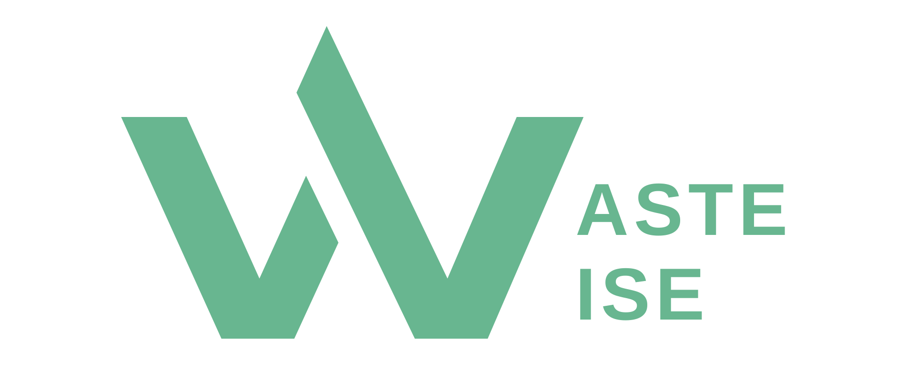

<a name="readme-top"></a>

<!-- PROJECT LOGO -->
<br />
<div align="center">
    

  <h3 align="center">Unlocking the power of sustainable waste management!</h3>
    <br />
  </p>
</div>


<!-- ABOUT THE PROJECT -->
## About The Project

WasteWise is a Revolutionary waste management Web Application with AI-powered recycling solutions. WasteWise uses Computer Vision to scan and classify the waste items. Leveraging geolocation services, the web app locates the nearest recycling points, e-waste collection or second hand stores, making waste disposal convenient and efficient. 

### Why?

A staggering 7.39 million tonnes of solid waste was generated in Singapore in 2022, a [6% rise from the previous year](https://www.channelnewsasia.com/singapore/recycling-rate-waste-generated-statistics-singapore-nea-2022-3460796#:~:text=Around%207.39%20million%20tonnes%20of,on%20Wednesday%20(May%203)). 

Yet, Singapore's domestic recycling rate fell to a [record lowest in a decade - standing at 12%](https://www.straitstimes.com/singapore/domestic-recycling-rate-in-singapore-lowest-in-over-a-decade). 

The low recycling rates alluded to incorrect recycling due to the lack of awareness as to what items to recycle, and which channel to use to dispose of items.

WasteWise aims to make correct waste disposal convenient, easy and fuss-free.


<p align="right">(<a href="#readme-top">back to top</a>)</p>

### Built With

* Next.js
* Python FastAPI

<p align="right">(<a href="#readme-top">back to top</a>)</p>


<!-- GETTING STARTED -->
## Getting Started

This project consists of 2 parts, a next.js front-end and a Python fastAPI backend.

### Prerequisites

- Python 3.8

### Installation

1. Clone the repo
   ```sh
   git clone https://github.com/yongkheehou/WasteWise
   ```

#### Set Up Python Backend

2. Install Dependencies 
   ```sh
   pip install -r requirements.txt
   ```
3. Run the following command to start the app
   ```sh
   uvicorn app:app --host 0.0.0.0 --port 8000
   ```

<p align="right">(<a href="#readme-top">back to top</a>)</p>

<!-- LICENSE -->
## License

Distributed under the MIT License. See `LICENSE.txt` for more information.

<p align="right">(<a href="#readme-top">back to top</a>)</p>


<!-- ACKNOWLEDGMENTS -->
## Acknowledgments

- [Khee Hou](https://github.com/yongkheehou)
- [Jun Yu](https://github.com/chuajunyu)
- [Joshua]()
- [Shelia]()

<p align="right">(<a href="#readme-top">back to top</a>)</p>
